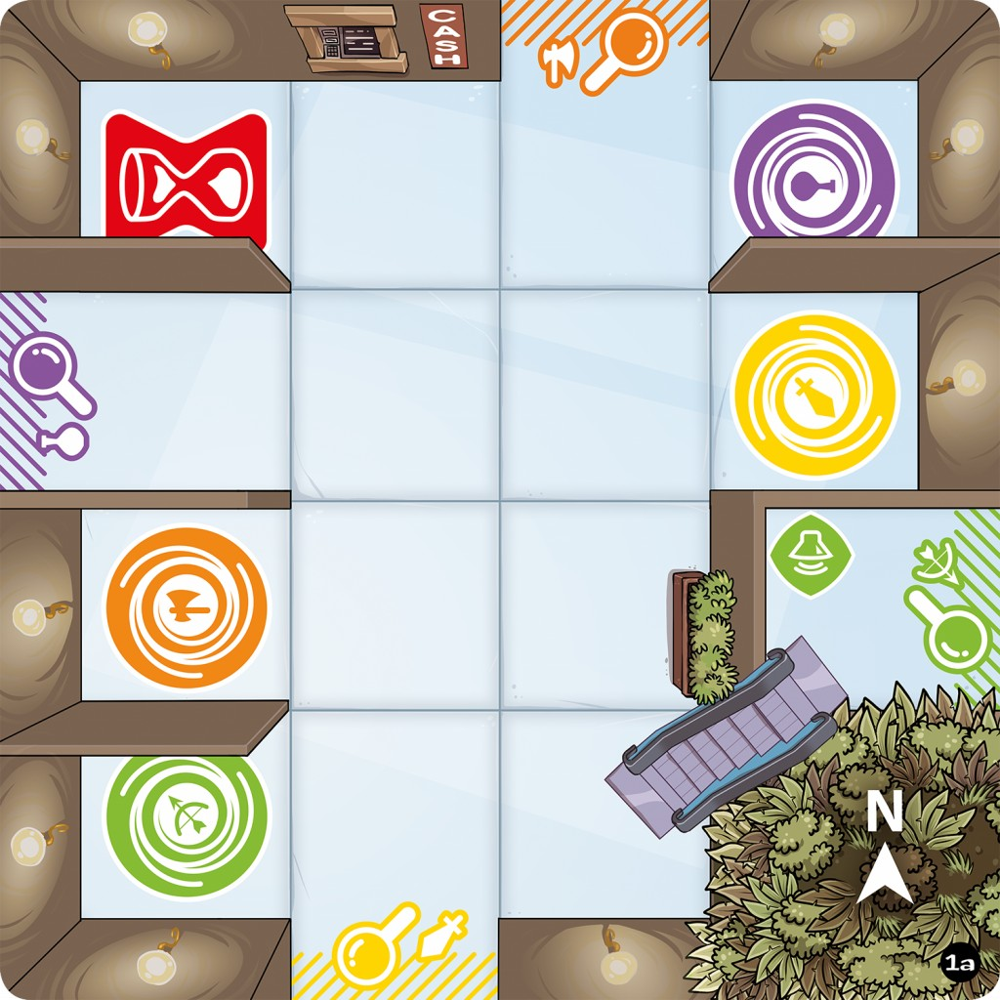
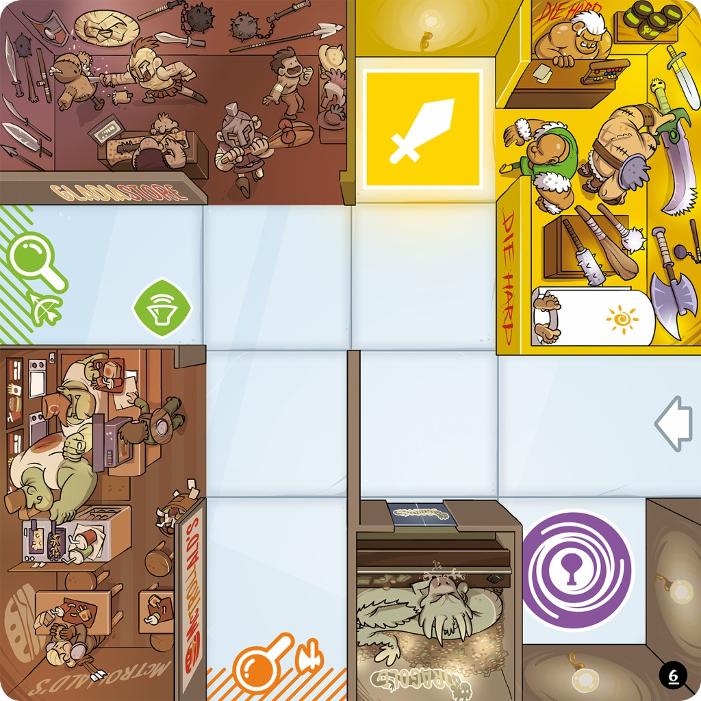

# Projet Magic Maze

## Index

1. [Introduction](#introduction)
    * [Objectif](#objectif)
    * [Compétences visées](#competences-visees)
    * [Réalisation](#realisation)
1. [Présentation du jeu](#presentation-du-jeu)
    * [Principe du jeu](#principe-du-jeu)
    * [Aventuriers](#aventuriers)
    * [Tuiles supermarché](#tuiles-supermarche)
    * [Cases spéciales](#cases-speciales)
    * [Déroulement de la partie](#deroulement-partie)
1. [Votre travail](#votre-travail)
    * [Mélangeur générique](#melangeur-generique)
    * [Génération de tuiles](#generation-tuiles)
    * [Plus courts chemins dans une tuile](#chemin-tuile)
    * [Gestion du supermarché](#gestion-supermarche)
    * [Plus courts chemins dans le sumerparché](#chemin-supermarche)
    * [Strategie de base](#strategie-base)
    * [Bonus](#bonus)

<a name="introduction"></a>
## Introduction

[//]: # "{{{"

<a name="objectif"></a>
### Objectif

Le but de ce projet est la réalisation d'un joueur automatique pour le jeu
[Magic Maze](https://www.youtube.com/watch?v=yWAwm46h3U0). Magic Maze est un jeu
de société de Kasper Lapp où les joueurs doivent orienter des aventuriers dans
un supermarché pour réaliser des objectifs. Votre joueur devra donc être en
mesure de calculer à partir d'une situation de jeu les meilleurs coups à jouer.

<a name="competences-visees"></a>
### Compétences visées

Ce projet vous fera mettre en pratique les algorithmes et structures de données
vus en cours pour résoudre un problème réel. Le projet s'articule autour des
algorithmes de recherche de plus courts chemins dans les graphes. La
modélisation du problème ainsi que les algorithmes de plus courts chemins feront
appel à des structures de données étudiées cette année ou les années
précédentes, en particulier des files, parfois à priorité, et probablement des
structures adaptées à des problèmes de type dictionnaire. À l'issue de ce
projet, vous devriez donc être en mesure d'utiliser ces algorithmes et
structures de données pour les problèmes pratiques que vous pourriez rencontrer
dans la suite de votre carrière.

<a name="realisation"></a>
### Réalisation

Vous réaliserez ce projet en binômes. Ce projet sera rendu avant la dernière
séance de TP du semestre. Durant cette dernière séance, les binômes proposeront
une démonstration de leur travail, et auront un petit entretien avec leur chargé
de TP pour expliquer leur code, la pertinence des choix de structures de
données, les complexités associées, les difficultés rencontrées, ainsi que les bugs
éventuels.

Votre projet devra être codé en C++. Vous êtes autorisés à utiliser l'ensemble
des fonctionnalités de la bibliothèque standard C++, en particulier les
conteneurs et les algorithmes. Pensez cependant à consulter les complexités de
ces structures et algorithmes pour vous assurer qu'ils sont appropriés au
problème sur lequel elles sont utilisées. Votre code doit être personnel, mais
vous êtes utilisés à reprendre du code trouvé en ligne tant qu'il ne s'agit pas
explicitement des solutions complètes des exercices. Ces morceaux de code
devront être clairement indiqués en commentaires comme repris, avec le lien vers
les pages sur lesquelles le code a été trouvé, et la licence du code lorsqu'elle
est fournie.

[//]: # "}}}"

<a name="presentation-du-jeu"></a>
## Présentation du jeu

[//]: # "{{{"

<a name="principe-du-jeu"></a>
### Principe du jeu

Dans le jeu Magic Maze, quatre aventuriers commencent au beau milieu d'un
supermarché. Les joueurs devront les déplacer pour petit à petit découvrir de
nouvelles zones du supermarché jusqu'à avoir découvert les objectifs des quatre
aventuriers, et les sorties du supermarché. Une fois les objectifs découverts,
les aventuriers doivent s'y rendre, puis ressortir du supermarché. Le tout doit
être réussi en temps limité. Tous les joueurs contrôlent en même temps tous les
aventuriers, mais chaque joueur ne peut déplacer les aventuriers que dans une
seule direction (haut, bas, gauche, droite) qui lui est indiquée en début de
partie. Les joueurs doivent donc se coordonner pour déplacer les pions, mais
n'ont en plus que très rarement le droit de se parler pour se mettre d'accord.

<a name="aventuriers"></a>
### Aventuriers

Les aventuriers sont matérialisés par des pions de couleur, placés sur le
plateau de jeu. Leur couleur sert à identifier les éléments du plateau qui leur
correspondent (portes, objectifs, sorties). Les couleurs sont le jaune, le
violet, le vert et le orange.

<a name="tuiles-supermarche"></a>
### Tuiles supermarché

Le supermarché est matérialisé par des tuiles. Une tuile est un carré de 4x4
cases. Les cases peuvent être :

1. des couloirs, par lesquels les aventuriers peuvent se déplacer ;
1. des boutiques dans lesquelles les aventuriers ne peuvent pas aller.

Sur le bord des tuiles se trouvent des portes pour accéder aux tuiles voisines.
Les portes sont toujours placées aux mêmes endroits, il y en a au maximum quatre.
Chaque porte porte la couleur d'un aventurier (jaune, violet, vert, orange), une
tuile n'aura jamais deux portes de la même couleur. Les portes sont accessibles
via des cases couloir, et les cases couloir sont placées de telle sorte qu'il
soit toujours possible de trouver un chemin pour aller de n'importe quelle case
couloir à n'importe quelle autre.

Lorsqu'un aventurier atteint une case avec une porte, si l'aventurier est de la
même couleur que la porte il est alors possible de découvrir une nouvelle tuile
du supermarché, qui viendra se placer de l'autre côté de la porte. Les tuiles
ont une marque indiquant quelle porte de la nouvelle tuile vient se placer à
côté de la porte utilisée pour la découvrir. Une fois qu'une tuile est placée,
tous les aventuriers peuvent y accéder par n'importe quelle porte (en respectant
les règles de déplacement).

Les nouvelles tuiles sont piochées au hasard, ce qui fait qu'à chaque partie
l'agencement du supermarché est différent.

<a name="cases-speciales"></a>
### Cases spéciales

Certaines cases sont particulières. Pour simplifier les règles du jeu, nous ne
considérerons dans un premier temps que deux cases spéciales (il y en a plus
dans le jeu réel):

1. les cases objectif, il y en a une par aventurier pour tout le supermarché, de
  la couleur de l'aventurier ;
1. les cases sorties, il y en a également une par aventurier pour tout le
  supermarché, de la couleur de l'aventurier.

<a name="deroulement-partie"></a>
### Déroulement de la partie

En début de partie, une tuile de départ est utilisée. Cette tuile est telle que
les quatre cases centrales sont des couloirs, et les aventuriers sont répartis
aléatoirement sur ces quatre cases. Chaque joueur se voit attribuer une
direction : haut, bas, gauche, droite (le jeu réelle donne éventuellement
quelques rôles supplémentaires aux joueurs, mais nous en resterons aux
directions dans un premier temps). Les joueurs jouent tous en même temps et
peuvent déplacer tous les aventuriers dans leur direction. Lors d'un déplacement
dans une direction, l'aventurier peut être déplacé d'autant de cases que
souhaité, tant qu'il reste sur des cases couloir et ne passe pas par une case
occupée par un autre aventurier.

Les joueurs doivent :

1. trouver les cases objectif de tous les aventuriers, et faire en sorte que
   tous les aventuriers soient en même temps sur leur case objectif.
1. faire sortir tous les aventuriers du supermarché par la case sortie qui leur
   correspond.

Ces objectifs doivent être remplis dans un temps limité. Pour simplifier les
règles, nous considèrerons que le joueur automatique doit chercher et utiliser
les chemins les plus courts possibles (en terme de nombre de coups à réaliser)
pour amener les aventuriers aux portes de leur couleur et découvrir le
supermarché, puis pour les emmener à leurs objectifs ou leurs sorties.

[//]: # "}}}"

<a name="votre-travail"></a>
## Votre travail

[//]: # "{{{"

Votre travail consiste à élaborer un joueur automatique pour jouer au jeu Magic
Maze. Le joueur devra être en mesure de décider pour chaque aventurier, étant
donné une situation de jeu, s'il doit le déplacer ou non, et jusqu'où.

Ce projet s'articule autour de plusieurs sous-parties. Les premières parties
consistent à vous doter d'outils pour modéliser le jeu. Vous étudierez ensuite
comment calculer les déplacements nécessaires pour amener un aventurier à une
position donnée en utilisant le moins de coups possibles.

<a name="melangeur-generique"></a>
### Mélangeur générique

[//]: # "{{{"

Pour générer des tuiles de supermarché et gérer des parties, le premier outil
que nous vous proposons de programmer est un *mélangeur*. Ce mélangeur pourra
ensuite être utilisé pour générer aléatoirement des tuiles de jeu, ou gérer la
pioche de tuiles dans une partie par exemple.

#### Fonctionnalités

Un mélangeur est une structure dans laquelle vous pourrez ajouter des éléments
ou en retirer. Vous ne pouvez retirer des éléments que s'il y en a dedans. À
chaque retrait, l'élément renvoyé est choisi aléatoirement parmis les éléments
présents dans le mélangeur, puis retiré. Votre mélangeur proposera donc les
fonctionnalités suivantes :

* construction produisant un mélangeur vide
* destruction libérant toute mémoire possédée par le mélangeur
* ajout d'un élément
* retrait d'un élément
* consultation du nombre d'éléments présents

#### Généricité

Ne sachant pas a priori ce que nous allons mettre comme éléments dans le
mélangeur, mais étant donné qu'il pourra être utile en différents points du
projet, vous utiliserez le concept des adresses génériques pour rendre votre
structure de données adaptable à de nombreux types de données. Le principe est
donc le suivant :

* votre structure de données travaille en manipulant des octets sans savoir ce
  qu'ils représentent. La seule information connue et fournie à la construction
  de la structure est le nombre d'octets nécessaires pour un élément.
* chaque nouvel élément à insérer vous sera fourni par une adresse générique de
  type `void *`. À cette adresse se trouveront les octets de l'éléments à
  insérer.
* à chaque retrait, une adresse générique est fournie pour y recopier les octets
  de l'élément retiré. Il est supposé qu'à cette adresse, le nombre d'octets
  disponible est suffisant pour stocker l'objet.

#### Code de base

Vous trouverez dans le dépôt ci-présent des fichiers `melangeur.[hc]pp`, un
fichier de test `test_melangeur.cpp` et un `Makefile` pour les compiler. Le code
compile, mais les tests ne passent pas car le mélangeur ne fait absolument rien.

#### Avertissement pour la suite

Ce type de généricité utilisée en C casse le mécanisme des constructeurs et
destructeurs du C++ : lorsque vous insérez ou retirez un élément dans votre
mélangeur, aucun constructeur ou destructeur n'est appelé. Faites donc bien
attention à vous assurer que les éléments que vous stockez dans le mélangeur
peuvent être manipulés de cette façon.

[//]: # "}}}"

<a name="generation-tuiles"></a>
### Génération de tuiles

[//]: # "{{{"

Pour pouvoir étudier le jeu, vous programmerez ensuite un générateur de tuiles.
Ce générateur permettra de générer des tuiles au hasard et vérifier que vos
algorithmes fonctionnent correctement.

Les sources fournies avec le projet contiennent un couple de fichiers
`tuile.[hc]pp` de base avec une fonction d'affichage simple.

#### Dimension des tuiles

Comme indiqué plus haut, une tuile est un carré de 4x4 cases. 
Pour nous faciliter la vie par la suite, nous les numéroterons comme suit :

```
+---+---+---+---+
| 0 | 1 | 2 | 3 |
+---+---+---+---+
| 4 | 5 | 6 | 7 |
+---+---+---+---+
| 8 | 9 | 10| 11|
+---+---+---+---+
| 12| 13| 14| 15|
+---+---+---+---+
```

Des fichier `case.[hc]pp` vous sont fournis pour vous aider à manipuler cette
numérotation.

#### Types de tuiles

Vous devrez pouvoir créer deux types de tuiles. Une tuile de *départ* est
utilisée pour démarrer la partie. Les pions sont initialement placés sur une
telle tuile, et toutes les tuiles découvertes ensuite sont des tuiles
*classiques*.

* une tuile de départ :



* une tuile classique :



Ces ilustrations sont tirées du jeu original, illustré par Gyom.

#### Portes

Les portes pour passer de tuile en tuile sont toujours placées aux mêmes
endroits, au niveau des cases 2, 4, 11 et 13. 

Une tuile de départ à toujours quatre portes, une de la couleur de chaque
aventurier. 

Une tuile classique a une porte d'accès qui n'a pas de couleur particulière :
c'est par cette porte qu'on entre sur la tuile pour la première fois lorsqu'on
traverse la porte d'une autre tuile. Cette porte est marquée d'une flèche sur
l'image ci-dessus. Par convention, nous générerons des tuiles classiques avec
cet accès sur la case 13. Les trois autres portes ne sont pas nécessairement
utilisées, mais au moins une porte permettra de sortir de la tuile. Si une tuile
classique comporte plusieurs portes, il n'y en aura pas deux de la même couleur.

#### Départ

Sur une tuile de départ les pions commencent sur les quatre cases centrales : 5,
6, 9, 10.

#### Sites

Les *sites* sont des cases particulières sur une tuile. Une porte est un site.
En plus des portes, une case peut être garnie de quelques points d'intérêt.
Comme mentionné plus haut, pour vous simplifier la vie, nous ne considérerons
pour l'instant que les objectifs des aventuriers et leurs sorties. Pour la case
de départ, il y aura également quatre sites correspondant aux points de départ
des aventuriers.

Pour résumer un site peut être :

* une porte ou un accès
* un objectif
* une sortie
* un point de départ

Le placement des sites est soumis à quelques rèclges :

* deux sites ne peuvent pas être sur la même case
* il n'y a ni objectif ni sortie sur une tuile de départ
* il n'y a pas plus d'un objectif par tuile
* il n'y a pas plus d'une sortie par tuile
* il n'y a pas à la fois un objectif et une sortie sur une tuile

#### Murs

Entre les cases se trouvent éventuellement des murs. Dans la suite, si nous
avons besoin de numéroter les murs, ils seront numérotés comme suit :

```
+---+---+---+---+
|   12  16  20  |
+ 0 + 1 + 2 + 3 +
|   13  17  21  |
+ 4 + 5 + 6 + 7 +
|   14  18  22  |
+ 8 + 9 + 10+ 11+
|   15  19  23  |
+---+---+---+---+
```

Des fichiers `mur.[hc]pp` vous sont fournis pour vous aider à manipuler ces
indices.

#### Principe de la génération

Pour générer les tuiles, vous commencerez par suivre le principe suivant :

* commencer par déterminer si la tuile est une tuile classique ou de départ ;
* déterminer aléatoirement le nombre, la position et la couleur des portes ;
* ajouter si nécessaire les points de départ ;
* positionner éventuellement un objectif ou une sortie sur une case restante ;
* considérer tous les murs comme en place ;
* briser aléatoirement des murs jusqu'à ce que tous les sites soient reliés.

#### Union-find

Dans le déroulé précédent, l'étape consistant à briser les murs comporte une
subtilité : il est nécessaire de déterminer si tous les sites sont reliés entre
eux. Pour réaliser ce test, vous utiliserez la structure d'*Union-Find*, célèbre
pour gérer des problèmes de types *classes d'équivalence*. Le principe est le
suivant :

Nous définissons que de cases sont *équivalentes* s'il existe un chemin pour
relier l'une à l'autre. Une *classe d'équivalence* est un ensemble de cases
mutuellement accessibles. Le principe de l'Union-Find est de proposer deux
opérations :

* Find : déterminer si deux éléments sont équivalents
* Union : fusionner deux classes d'équivalence pour les rendre équivalentes

Initialement, tous les murs sont en place, et aucune case n'est équivalente a
aucune autre. Chaque case est dans sa propre classe d'équivalence qui ne possède
qu'une case. À chaque mur brisé, une union est réalisée sur les classes
d'équivalence des deux cases de part et d'autre du mur. La destruction s'arrête
quand tous les sites sont dans la même classe.

##### Structure de données

Le principe de l'Union-Find est d'associer chaque classe d'équivalence à un
représentant. Chaque case se voit donc attribuer une case représentante.
Initialement une case est sa propre représentante.

##### Find

Une opération *Find* consiste à remonter la chaîne de représentants jusqu'à
trouver une case qui est sa propre représentante. Cette case est la
représentante de toute la classe. Si une case n'est pas sa propre représentante,
nous allons voir si sa représentante est sa propre représentante, et ainsi de
suite. Ne trouvez-vous pas que cette formulation a l'air très récursive ?

##### Union

Pour faire l'union de deux classes (distinctes), il faut aller chercher la case
représentante de chaque classe. Ces deux cases sont leur propres représentantes.
Il suffit alors de placer l'une comme représentante de l'autre. 

##### Compression de chemin

Pour améliorer la complexité des requêtes sur cette structure, il est possible
de modifier légèrement l'opération find pour faire en sorte que lorsqu'on
demande la représentante d'une case, une fois cette représentante calculée, elle
est directement stockée comme représentante de la case. De cette façon, la fois
suivante, il ne sera plus nécessaire de remonter tout le chemin pour trouver la
représentante. Et si votre focmulation est récursive, toutes les cases par
lesquelles nous passons pour chercher une représentante stockeront par la suite
directement cette représentante.

##### Limiter la hauteur

Notre structure de données est un arbre, avec des liens de bas en haut (des
feuilles vers la racine : la représentante). Le pire cas d'une recherche de
représentante consiste à parcourir l'arbre de bas en haut. Pour limiter la
complexité, il est donc possible de limiter la hauteur des arbres.

Pour chaque case, nous ajoutons en plus une *approximation* de la hauteur de
l'arbre qui a cette case pour représentante. Notez bien qu'il s'agit d'une
approximation et non d'une valeur exacte, qui serait très difficile à calculer
lorsque la compression de chemin est utilisée. Initialement la profondeur d'une
classe ne contenant qu'un élément est de 1.

Lors d'une fusion, une fois déterminées les deux représentantes, nous comparons
leurs hauteurs. Si l'une des deux a une hauteur strictement plus grande à
l'autre, alors la case la moins haute prend la case la plus haute comme
représentante, ce qui ne modifie pas les hauteurs. Si les deus hauteurs sont
égales, l'une ou l'autre est choisie comme représentante, et sa hauteur est
cette-fois augmentée de 1.

##### Complexité

Munis de ces optimisations, la complexité d'une requête *Find* ou *Union* en
fonction du nombre d'éléments présents dans la structure d'union find est
proportionnelle à la réciproque de [la fonction
d'Ackermann](https://fr.wikipedia.org/wiki/Fonction_d%27Ackermann). Cette
fonction est compliquée, mais ce qu'il faut en retenir, c'est qu'elle croît
moins vite que n'importe quel logarithme, et si lentement que pour $`n =
10^{80}`$ elle vaut environ 4.

<a name="boutiques"></a>
### Boutiques

Une fois tous les sites accessibles, une dernière passe esthétique consiste à
supprimer les impasses qui seront inutiles au jeu, et relier ensemble les cases
des boutiques.

Pour supprimer les impasses, vous pouvez itérer tant qu'il existe une case qui
n'est pas un site et qui n'a qu'un mur adjacent brisé. Cette case est donc une
impasse, et nous l'isolons en recontruisant le mur adjacent brisé. Lorsque plus
aucune case ne correpond, les impasses sont considérées comme éliminées.

Une fois les impasses supprimées, vous pouvez reconstruire les classes
d'équivalence qui ont été faussées par les murs reconstruits, en réinitialisant
la classe de chaque casse, et en fusionnant les classes des cases de part et
d'autre d'un mur brisé. Ensuuite, pour chaque case il est possible de déterminer
si elle est accessible depuis les sites (dans la même classe qu'eux) ou non.
Tout mur qui sépare deux cases qui ne sont pas accessibles depuis les sites est
abattu.

<a name="resultat"></a>
### Résultat

En modifiant la fonction d'affichage pour faire apparaître vos portes, vous
devriez pouvoir obtenir des tuiles semblables aux suivantes :

```txt
+---+---+ ^ +---+   +---+---+ ^ +---+   +---+---+---+---+
|       |   |   |   |       |       |   |               |
+   +   +   +   +   +   +   +   +   +   +---+   +   +   +
|           |   |   |       |       |   <   |           |
+   +   +---+   +   +---+---+---+   +   +   +   +   +   +
|       |       |   |       |       |   |   |           |
+---+   +   +   +   +   +   +   +   +   +   +---+   +   +
|   |   |       |   |               |   |       |       |
+---+ v +---+---+   +---+ v +---+---+   +---+ v +---+---+

+---+---+---+---+   +---+---+ ^ +---+   +---+---+ ^ +---+
|               |   |       |       |   |       |       |
+   +   +   +   +   +   +   +   +   +   +   +---+   +   +
|               |   <   |       |   |   |   |           |
+   +   +---+---+   +---+   +---+   +   +   +   +---+---+
|       |       >   |   |           >   |   |   |       |
+   +---+   +---+   +   +   +---+---+   +   +   +   +   +
|   |       |   |   |   |   |       |   |   |   |       |
+---+ v +---+---+   +---+ v +---+---+   +---+ v +---+---+
```

<a name="format_fichier"></a>
### Format de fichier commun

Pour échanger par la suite, nous utiliserons le format suivant pour écrire
une tuile dans un fichier :

```txt
tuile
mur 1
mur 2
...
mur 22
site 2 porte orange
site 4 porte vert
site 0 sortie vert
...
fin
```
Les règles sont les suivantes :

* la description d'une tuile commence par le mot `tuile`
* la description d'une tuile finit par le mot `fin`
* la description d'un mur se fait sur une seule ligne et commence par `mur`
* après le mot `mur` se trouve le numéro du mur, tel que défini précédemment
* la description d'un site se fait sur une seule ligne et commence par le mot `site`
* après le mot `site` se trouvent :
    * la case du site numérotée comme précédemment
    * le type de site (porte, départ, objectif ou sortie)
    * la couleur du site (jaune, vert, orange, violet, aucune pour un accès)

[//]: # "}}}"

<a name="chemin-tuile"></a>
### Plus court chemin dans une tuile

Une fois les tuiles fonctionnelles, vous pouvez commencer à élaborer votre
joueur en cherchant des plus courts chemins au sein d'une tuile : vous pourrez
ainsi déplacer les pions dans une tuile pour rejoindre une case donnée, porte ou
objectif.

#### Nombre de coups

Dans Magic Maze, chaque joueur est responsable d'une direction. Lorsqu'un joueur
déplace un aventurier, il peut le déplacer de plusieurs cases à la fois. Ainsi
nous considérerons que chaque déplacement dans une direction coûte un coup,
quelle que soit la longueur du déplacement.

À partir d'une tuile, vous générerez un graphe comportant un noeud par case.
Chaque nœud aura pour nœuds voisins les noeuds qui peuvent être atteints en un
coup depuis sa case. Chaque arête sera étiquetée par la direction du coup, ainsi
que sa longueur. Vous pourrez ainsi par la suite retrouver les coups à jouer à
partir de la séquence de noeuds du graphe.

À vous d'élaborer votre structure de données pour le graphe, à partir des
structures de données de base que vous connaissez.

#### Parcours en largeur

Dans votre graphe, il n'y a pas de notion de poids sur les arêtes : chaque arête
coûte un coup. Étant donné un point de départ et un point d'arrivée, vous pouvez
donc réaliser un simple parcours en largeur pour trouver le chemin le plus court
entre les deux.

<a name="gestion-supermarche"></a>
### Gestion du supermarché

Une fois les tuiles et les chemins fonctionnels, vous pouvez commencer à gérer
le plateau dans son ensemble. À vous de créer une structure de données pour la
gestion du supermarché dans son ensemble et l'assemblage des tuiles.

#### Rotation des tuiles

Par défaut, lors de la génération des tuiles, nous avons considéré que l'accès à
une tuile était réalisé via la case 13. Lorsque la porte qui a été ouverte pour
mener à cette nouvelle tuile est la porte de la case 2, tout va bien. Dans les
autres cas il vous faudra faire tourner votre tuile.

Pour vous aider dans la gestion de la rotation des tuiles, les classes `Case` et
`Mur` sont munies d'une méthode pour les faire tourner. Selon votre
implémentation d'une tuile, vous pourrez ainsi utiliser ces méthodes pour faire
tourner toute une tuile.

#### Connexion des graphes

Pour pouvoir rechercher les plus courts chemins globalement dans tout le
supermarché, il vous faudra reconnecter les graphes des tuiles individuelles.
Attention il ne suffit pas de mettre une arête entre les noeuds des cases des
portes : si vous mettez une arête avec un coût de 1, il n'est pas possible en un
seul coup de traverser une porte en ligne droite, l'algorithme considérera qu'il
faut s'arrêter à la porte. À l'inverse, si vous ajoutez une arête de coup 0, il
serait alors possible par exemple de passer de la case 7 à la case 11 en allant
vers le bas, puis de traverser la porte gratuitement lors qu'il y a eu un
changement de direction.

<a name="chemin-supermarche"></a>
### Plus court chemin dans le supermarché

Lorsque votre graphe total est réalisé, vous pouvez à nouveau calculer les plus
courts chemins via un parcours en largeur. Le parcours en largeur explore
cependant dans toutes les directions sans distinction. Il est cependant possible
d'utiliser l'algorithme A* pour essayer d'orienter cette recherche. À vous de
trouver une approximation du chemin restant à parcourir adaptée au problème.

<a name="strategie-base"></a>
### Stratégie de base

La stratégie de base pour le joueur consiste à trouver pour chaque pion
l'objectif le plus proche et à s'y rendre :

* s'il reste des objectifs ou des sorties à trouver, sa porte la plus proche ;
* si tout est trouvé, son objectif ;
* si les objectifs sont remplis sa sortie ;

Une fois le plus court chemin obtenu, s'il commence par la direction du joueur,
il déplace le pion. Attention, lorsque le plus court chemin n'est pas unique, il
pourrait y avoir blocage si deux joueurs ne considèrent pas le même chemin.
Pensez-vous pouvoir résoudre ce problème ?

<a name="bonus"></a>
### Bonus

N'attaquez les bonus que si le reste fonctionne. Ces bonus sont des pistes pour
continuer le travail, si vous en trouvez d'autres, faites vous plaisir.

#### Téléportation

Ajouter un nouveau type de site, les téléporteurs, et faites en sorte de les
gérer dans vos graphes et recherches de plus court chemin.

#### Gérer plusieurs aventuriers

Nous avons jusqu'à présent omis une règle importante du jeu :  les aventuriers
ne peuvent pas se croiser sur la même case. Pensez-vous pouvoir gérer le
problème ?

#### Accélérer la recherche

Lorsque l'aventurier et son objectif ne sont pas sur la même tuile, l'aventurier
va devoir passer de tuile en tuile. Ne serait-il pas possible d'augmenter le
graphe avec des noeuds supplémentaires, et de précalculer le chemin de porte en
porte pour ne pas avoir à recalculer les chemins à l'intérieur des tuiles
traversées ?

[//]: # "}}}"
# tpTEST
